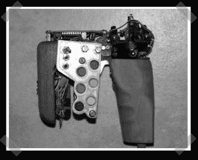

# DIY 电脑游戏枪

> 原文：<https://hackaday.com/2008/04/10/diy-pc-gaming-gun/>

【rust labs】[为 FPS 游戏组装了一把外观有趣的游戏枪](http://www.instructables.com/id/FPS-arcade-style-gun/)。他写下了他的构建以及如何使用网络摄像头为《半条命 2》等游戏提供枪支追踪。他挖出了一个键盘来提供按钮接口，枪体上的红外发光二极管由摄像头跟踪。令人惊讶的是，在构建中没有牺牲 USB 游戏垫，只有一个 USB 键盘和鼠标。

*   [永久链接](http://www.instructables.com/id/FPS-arcade-style-gun/)