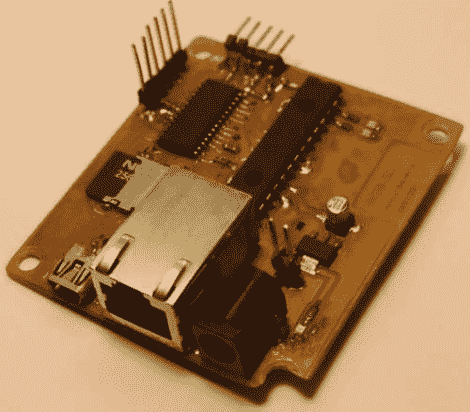

# DIY PIC 开发板和网络服务器

> 原文：<https://hackaday.com/2011/02/12/diy-pic-development-board-and-web-server/>

受到 Hack-a-Day 上的一个项目的启发，[arthurb] [给自己买了一台 PIC 24F，并在学会芯片编程的来龙去脉后开始试验](http://www.instructables.com/id/WEBSD)。对于他最初的几个项目来说，使用试验板和一组电线还不错，但随着他的深入，他开始觉得需要一个成熟的开发板。考虑到一系列需要的功能，他开始工作，构建了一个经过深思熟虑的板以及一些可用于各种其他项目的扩展板。他的主开发板包括用于网络服务器软件的以太网连接、利用 SD 卡进行存储的能力以及用于编程的 USB 端口。他的扩展板包括温度传感器、数字触摸板和视频输出模块。总的来说，这是一个相当令人印象深刻的建设，考虑到他从来没有在开始这个项目前编程一张照片。他的所有电路板都有完整的文档，他还提供了大量的源代码，希望能帮助其他刚刚开始 PIC 编程的人。

你可以在这里看到他的网络服务器在运行[，但是请记住，它是在运行一张图片，所以请在使用时保持礼貌。](http://websd.no-ip.org/)