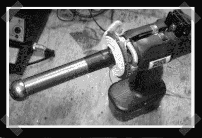

# DIY 等离子枪

> 原文：<https://hackaday.com/2007/08/08/diy-plasma-gun/>

【理查德】又试了一次电池供电的特斯拉线圈。他送来了他最新的手持等离子枪。他改装了他的[电池供电的特斯拉](http://www.hackaday.com/2007/07/07/battery-powered-tesla-coil/)线圈，作为手持设备使用。他在钻柄上加了一个大铜垫，将射频地线连接到手持 T4 火炬的人身上..当然，我们最近看到了很多特斯拉，但这里谁不想要一个呢？(可能是服务器机房的那个人……)

所有需要的部分都列出来了——只是要确保你在进入这一步之前完全理解了一切。

*   [永久链接](http://www.rmcybernetics.com/projects/DIY_Devices/plasma-gun.htm)