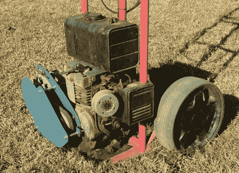

# DIY 便携式充电器/发电机

> 原文：<https://hackaday.com/2011/09/08/diy-portable-chargergenerator/>

后棚的[Glenn]这些年来建造了许多风车和固定发电机，但最近决定尝试建造一些更便携的东西。

该充电器基于相对简单的设计，采用 5.2 马力的 Kubota 4 冲程电机和 12v 汽车交流发电机提供动力。虽然你可能倾向于指出，他的充电器完全是为了交流发电机和电机而制造的，但这不仅仅是简单地将两个部分合在一起。

一个激光切割转接板将电机和交流发电机连接在一起，但一旦[格伦]把东西包起来，让电机旋转，他意识到他在反向驱动交流发电机。这将最终导致交流发电机过热，因为冷却风扇运行方式错误。他拆下风扇，用锤子把散热片倒转过来，这样他就可以得到他需要的冷却，而不必以相反的方向重新安装交流发电机。

为了便于携带，整个套件被安装在一辆手推车上，并且[Glenn]说，在一个没电的电池有足够的电力启动发动机之前，充电器/发电机只需要运行大约 5 分钟。

[via [HackedGadgets](http://hackedgadgets.com/2011/09/07/portable-car-alternator-charging-system/)