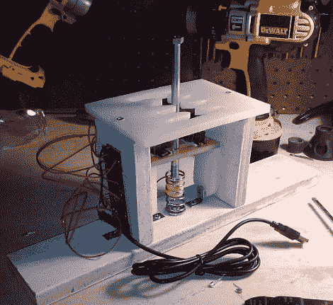

# DIY 赛车模拟移动盒

> 原文：<https://hackaday.com/2011/02/22/diy-racing-sim-shift-box/>

问问任何拥有手动挡汽车的人——在现实生活和电子游戏中，没有什么比手动挡更好的了。论坛成员[nikescar] [花了大约 20 美元自己做了一个](http://forums.hackaday.com/viewtopic.php?f=3&t=327)，而不是花大价钱去买一个预制的变速箱。

他用一些废木头和一块塑料切菜板做了一个原型。“H”型移位模式在 CAD 中设计，并放置在用 Dremel 手工切割的切割板上。利用网上找到的一些技巧，他构建了一个简单的移动机制，然后连接到 Ebay 上找到的一个便宜的 USB 游戏手柄上。使用安全别针作为临时微型开关，他跑了几圈，对结果相当满意。一旦开关到达，它们就被安装到变速箱上，然后开始比赛。

[nikescar]报告说，移位器工作得非常好，使他能够最轻松地通过齿轮，而不用担心打破东西。继续阅读，以便更好地了解变速箱内部。

[https://www.youtube.com/embed/MEJT4V1UzZ4?version=3&rel=1&showsearch=0&showinfo=1&iv_load_policy=1&fs=1&hl=en-US&autohide=2&wmode=transparent](https://www.youtube.com/embed/MEJT4V1UzZ4?version=3&rel=1&showsearch=0&showinfo=1&iv_load_policy=1&fs=1&hl=en-US&autohide=2&wmode=transparent)