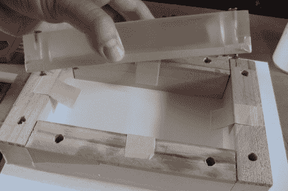

# DIY 树脂浇铸工程箱

> 原文：<https://hackaday.com/2011/04/25/diy-resin-cast-project-box/>

[Rhys]来信分享了他使用聚酯树脂从头开始构建的定制项目箱。他表示，在新西兰，他很难找到完美的项目箱。它们通常太大或太小，无法完成工作，[所以他认为还不如自己造一个。](http://blog.rhysgoodwin.com/fabrication/resin-cast-project-enclosure/)

利用谷歌 SketchUp，他设计了自己理想的项目箱，然后开始忙着建造木制模具。他从当地一家公司获得了一些免费的三聚氰胺废料，用来建造他的模具底座。一旦内外模具建好，他就把它们固定在底座上，并混合一些聚酯树脂。

几个小时后，他拆开了他的模具，用一些砂纸把他的项目箱弄平。他钻了螺丝孔，然后准备为盒子做盖子和底座。

他承认这个过程相当复杂，但是为你自己建造一个专门为这个项目建造的围栏还是有必要的。如果你想做类似的事情，一定要看看他的博客——他提供了一些合理的树脂铸造技巧，以及一些要避免的陷阱。