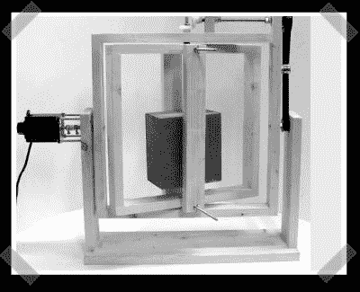

# DIY 滚塑

> 原文：<https://hackaday.com/2008/01/01/diy-rotomolding/>

[滚塑](http://en.wikipedia.org/wiki/Rotational_molding)用于在材料覆盖并硬化至模具形状时，通过缓慢旋转模具来制造空心形状。[ds]制造[这种](http://www.solsylva.com/cnc/rotomold.html)版本使用步进电机驱动组件和皮带传动链接，极端版本用于形成激流皮艇和其他塑料。cnczone 的这款线有一个烤肉店烤箱版本，看起来非常适合小型塑料或蜡成型。

*   [永久链接](http://www.solsylva.com/cnc/rotomold.html)