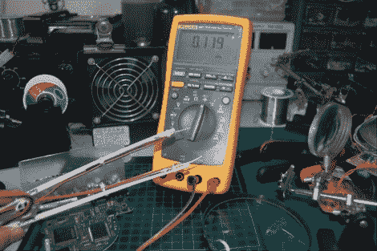

# DIY 智能镊子让 SMD 工作不在话下

> 原文：<https://hackaday.com/2011/08/10/diy-smart-tweezers-make-smd-work-a-cinch/>

[Noel]做了很多 SMD 工作，他想要一对“智能”镊子,既可以用来放置元件，也可以用来动态读取它们的电容和电阻值。正如我们所见，[这些东西可能有点贵](http://hackaday.com/2009/02/13/tools-smart-tweezers/)，如果你已经有一个好的万用表，就没必要了。考虑到这一点，他认为他可以几乎不花钱就造出自己的。

他从一双耐用的儿童“训练”筷子开始，但更重要的是，它不导电。他拿起第二把镊子，这次是用金属做的，把它们一分为二。他将电线焊接到一组环形端子上，在断裂的镊子的每条腿上安装一个。组装的最后一步包括使用拉链将所有东西安装在塑料筷子上，并在他的探针末端添加香蕉插头。

[Noel]说镊子非常好用，而且价格这么低，我们没什么可争辩的。