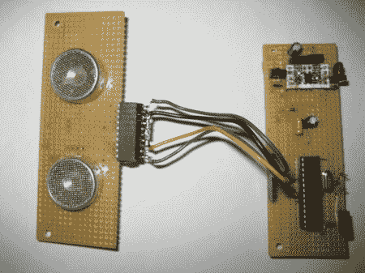

# 5 美元的 DIY 超声波测距仪

> 原文：<https://hackaday.com/2011/01/24/diy-ultrasonic-range-finder-for-5/>

在网上找到一些一美元一个的超声波传感器后，Kerry Wong 决定发明一个超声波测距仪。结果很像 parallax 的 PING .))传感器，但便宜得多。他的帖子不仅是节省一些钱的好方法，而且很好地解释了超声波传感器的工作原理。发射电路本质上是一个 H 桥，很像控制电机的电路。为了收听返回的回声，他使用一对高增益/低噪声运算放大器来过滤和放大信号。他用来测试测距仪的电路板(不包括在成本中)是运行 Arduino 引导加载程序的 ATMega328。他还提供了大量示例代码。