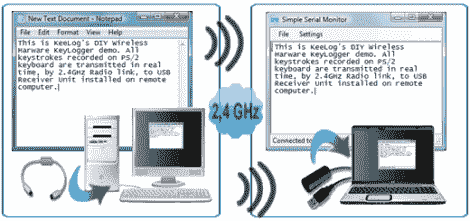

# DIY 无线键盘记录器让你感觉像詹姆斯·邦德(在你自己的小世界里)

> 原文：<https://hackaday.com/2011/03/09/diy-wireless-keylogger-makes-you-feel-like-james-bond-in-your-own-little-world/>

当孩子们浏览互联网时，你需要监视他们吗？你的丈夫/妻子呢——你怀疑他们在业余时间涉猎课外活动吗？嘿，你有你的~~不安全感~~理由，我们不做评判。然而，我们会向你展示[Jerry]最近在 Keelog 所做的工作。

虽然该公司在网上销售硬件键盘记录器套件，但[Jerry]依赖并理解开源的重要性。由于我们都从开放中受益，他透露了他最近一个项目的所有细节，这个项目就是无线键盘记录器。键盘记录器插入 PC 的 PS/2 端口，无线发送数据到 20 码外附近的 USB 加密狗，所有这些都是实时的。

提供了详细的器件清单、原理图、PCB 掩模、固件和组装说明。然而，如果你喜欢更简单的路线，你可以随时购买完整的产品或 DIY 套件。

这不是他发布的第一个开源键盘记录程序，所以如果你喜欢有线键盘记录解决方案，一定要看看他以前的作品。