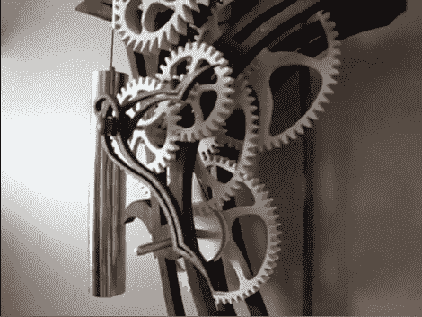

# 你有办法让木材保持同步吗？

> 原文：<https://hackaday.com/2011/07/31/do-you-have-what-it-takes-to-make-lumber-keep-time/>

[弗兰克]发送了一个链接到这个神奇的木制时钟。这个设计是由克莱顿·博耶(Clayton Boyer)构想出来的，他在自己的网站上出售全尺寸的模板。我们过去曾惊叹于他的创造，特别是[用木制齿轮制成的无用机器](http://hackaday.com/2010/06/16/most-useless-machine-loses-carbon-footprint/)。这款“天堂鸟”时钟将复杂性提升了一点，创造了一款没有表壳的钟表，以展示所有这些牙齿的美丽。

我们想知道自己造一个这样的东西需要什么。从 [FAQ 页面](http://www.lisaboyer.com/Claytonsite/frequentquestions.htm)看起来你可以用一个线锯、钻床、Dremel 和砂光机。这是中等技术的方法，但你可以选择扫描计划，以便激光切割你的零件，或者[只使用手工工具](http://hackaday.com/2011/06/24/building-a-robot-without-using-a-machine-shop/)。但是除了建立提示之外，还有关于如何微调不想继续运行的时钟的建议，关于完成木头部件、打磨、调整牙齿的想法，等等。众所周知，我们热爱数字时钟项目，但像这样不用电的设计非常诱人。不要错过休息后的剪辑，看看我们的意思。

[https://www.youtube.com/embed/m88hSkT8dEk?version=3&rel=1&showsearch=0&showinfo=1&iv_load_policy=1&fs=1&hl=en-US&autohide=2&wmode=transparent](https://www.youtube.com/embed/m88hSkT8dEk?version=3&rel=1&showsearch=0&showinfo=1&iv_load_policy=1&fs=1&hl=en-US&autohide=2&wmode=transparent)