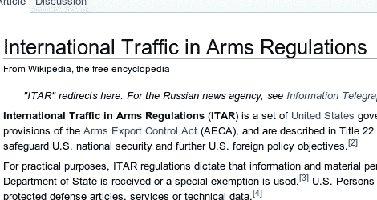

# 你的项目是否违反了国际武器交易条例？

> 原文：<https://hackaday.com/2011/04/12/do-your-projects-violate-international-traffic-in-arms-regulations/>

我们不时会考虑黑客技术被用于邪恶目的的后果。知识是一种强大的东西，但它本身并不危险。恶意的意图是什么采取了一个聪明的项目，并把它变成一个悲惨的结局。有良知的黑客意识到了这一点，[乔治·哈德利]就是其中之一。在进行一个新项目时，他想知道是否有关于哪些知识应该和不应该共享的指导方针。原来，美国有一套国际武器交易条例，其中提到了我们在许多项目中看到的概念。他写了一篇文章，涵盖了 ITAR 的要点。

其要点是，通过在互联网上发布或其他方式分享某些知识，可被视为武器贩运。这会让你受到政府官员不太友好的访问，并且很有可能得到一个安全设施的赞助。关于 DIY 雷达、通信干扰、间谍设备、无人机和一些其他概念的信息禁止共享。该限制的一个限定部分是，它仅适用于信息不为公众所知的情况。