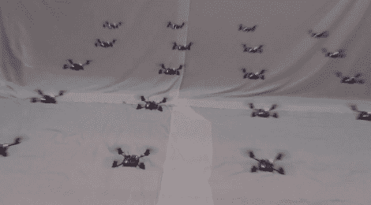

# 狗荚格离现实更近一步

> 原文：<https://hackaday.com/2012/02/03/dog-pod-grid-one-step-closer-to-reality/>

有什么比一架令人惊叹的杂技四轴飞行器更好的呢？一群杂技微型四轴飞行器怎么样？这不是一个修辞问题，而是一个实验现实。宾夕法尼亚大学的一个团队展示了他们最新一轮的悬停机器人，这些机器人可以编队移动，并作为一个群体改变它们的方向。

你可能还记得 2010 年，我们对该团队用一架直升机完成的令人难以置信的特技表演垂涎三尺。该设备需要一个复杂的摄像头装置来提供反馈，这使用了相同的框架。但是我们不要因此而减损成就；这只是项目未来的一个障碍。

休息后的视频展示了旋转装置的一些特技。看着它们像网格一样移动，甚至同时落地，我们不禁想起尼尔·斯蒂芬森的书*钻石时代*中的狗荚网格。它被用作一种保护系统，将不受欢迎的飞行入侵者挡在外面。听起来不再那么牵强了吧？

[https://www.youtube.com/embed/YQIMGV5vtd4?version=3&rel=1&showsearch=0&showinfo=1&iv_load_policy=1&fs=1&hl=en-US&autohide=2&wmode=transparent](https://www.youtube.com/embed/YQIMGV5vtd4?version=3&rel=1&showsearch=0&showinfo=1&iv_load_policy=1&fs=1&hl=en-US&autohide=2&wmode=transparent)

[http://hack aday . com/2010/05/28/quad copter-acrobatics-like-nothing-we ve-seed/](http://hackaday.com/2010/05/28/quadcopter-acrobatics-like-nothing-weve-seen/)