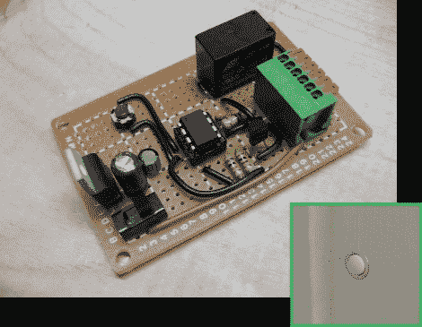

# 门铃组合锁可以打开你的车库门

> 原文：<https://hackaday.com/2010/08/02/doorbell-combo-lock-can-open-your-garage-door/>

有时候，我从写别人的成就中获得了足够长的时间，可以自己动手做黑客了。最近，我开发了一种可以打开车库门的密码锁。这个想法不是原创的，它是基于【艾伦·帕瑞克的】[按钮代码](http://alan-parekh.com/projects/button-code-single-button-code-entry-system/)项目，但我确实开发了自己的硬件和软件。输入第一个数字时，多次按下按钮，等待内部 LED 闪烁，然后再输入下一个数字。如果输入正确的密码，门就会打开。

我的版本以一个态度为中心。我最初下载[艾伦的]代码，希望我可以很容易地移植 PIC 固件。不幸的是，它是用 BASIC 语言写的，所以我只是用我所知道的关于界面的知识写了我自己的程序。我在 ATmega168 上开发，这样我就不会有编程空间不足的问题，并且能够将我的代码优化到 964 字节以适应 tiny13。

硬件相当简单。我从家得宝买了一个带灯的门铃，把灯泡换成了 LED。我选择这个是因为门铃安装在车库门饰板上的一个 5/8 英寸的孔里，很容易被忽略。我对结果非常满意，如果你想玩这个想法，你可以很容易地在试验板上建立电路，并使用另一个 LED 作为负载，而不是包括一个继电器。点击本文顶部的链接查看原理图、代码和构建图像。