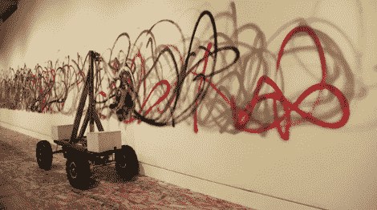

# 双摆喷雾赋予这个涂鸦机器人一些风格

> 原文：<https://hackaday.com/2011/11/17/double-pendulum-spray-gives-this-graffiti-bot-some-style/>

这是一个独立绘画的艺术展览。[无感绘图机器人](http://thisisnotagraffiti.tumblr.com/) ( [译](http://translate.google.com/translate?sl=auto&tl=en&js=n&prev=_t&hl=en&ie=UTF-8&layout=2&eotf=1&u=http%3A%2F%2Fthisisnotagraffiti.tumblr.com%2F))利用轮式基座的前后运动实现双摆臂摆动。在失控附体的末端，一罐喷漆被释放出来。我们对结果有点惊讶，因为它们看起来不像是机器制造的。

休息后的视频很好地概括了机器人是如何执行任务的。上面链接的站点有点难导航，但是如果你开始挖掘，你会发现很多构建信息。例如，它看起来像是用一辆小型遥控车和木棒作为钟摆的原型。

我们不禁想起这个[机器人，它平衡了一个倒立的双摆](http://hackaday.com/2010/11/27/balancing-inverted-pendulums/)。我们想知道它是否可以被黑客攻击，有目的地画出比我们在这里看到的更有意义的涂鸦？

【维梅奥 http://vimeo.com/30780208 w = 470】

[感谢 Brian via [IEEE 频谱](http://spectrum.ieee.org/automaton/robotics/diy/senseless-drawing-robot-should-probably-be-arrested?utm_source=feedburner&amp;utm_medium=feed&amp;utm_campaign=Feed%3A+IeeeSpectrum+%28IEEE+Spectrum%29)