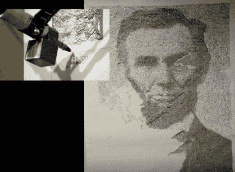

# Drawbot 制作肖像…非常慢

> 原文：<https://hackaday.com/2010/06/06/drawbot-produces-portraits-very-slowly/>

这个机器人艺术家，[draw bot](http://www.unanything.com/unanything/Site/Secret_Work/Entries/2010/6/1_Drawbot.html)，使用 Arduino 和处理产生图像。一张纸贴在墙上，连接到几个步进电机的手写笔在上面画出图案，逐渐变成上面看到的图像。每幅画都是不同的，可能需要几个星期的持续操作才能完成。这一定使调试在开发过程中成为[Harvey]的一个真正的问题。我们想知道这是否适用于[自制铅笔](http://hackaday.com/2010/05/20/personal-pencil-production-plant/)？