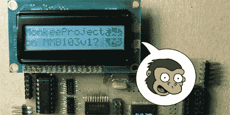

# 在字符显示器上绘制图像

> 原文：<https://hackaday.com/2008/06/12/drawing-images-on-a-character-display/>

【迪安·霍尔】似乎不太了解他的《辛普森一家》中的角色，但这并没有阻止他想出[这种用日立 HD44780 芯片在液晶字符显示器](http://deanandara.com/robots/ApuLcd.html)上显示位图的方法。

[Hall]使用了一个具有两行 16 字符和每个字符 8×5 像素的 LCD。他显示了超过 2×3 个字符的图像，这给他 17×18 个像素(包括字符之间的空间)来处理。获取图像后的第一步是将图像手工栅格化到绘图纸上。这个就不扫描了，只是一个确定哪些像素点亮的图。

一旦确定了 6 个字符，[Hall]就使用[这个方便的基于网络的工具](http://www.quinapalus.com/hd44780udg.html)将他的图表转换成位图数据。数据被加载到微控制器上，图像显示在 LCD 上。这是一个非常简单的项目，只要[确保你正确识别你的猴子](http://en.wikipedia.org/wiki/List_of_animals_in_The_Simpsons#Mojo)。

[途径〔t0〕你的电子〔t1〕

*   [永久链接](http://deanandara.com/robots/ApuLcd.html)