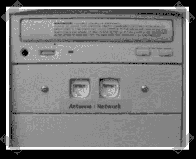

# 驱动器托架 PoE 适配器

> 原文：<https://hackaday.com/2007/10/20/drive-bay-poe-adapter/>

当然，我们在之前已经见过以太网供电[——我甚至为我的](http://www.hackaday.com/2005/05/21/power-over-ethernet/)[改装的 wrt54gs](http://biobug.org/hard-wrt54gs/) 做了一个[简单适配器](http://biobug.org/hard-wrt54gs/poe.php)。这个是一个很好的干净的设置，它将使你免于又一个电源模块。(我有一个专用于我的小型家庭数据中心的电源板。)

*   [永久链接](http://kawasaki.kz/wireless/poe.htm)