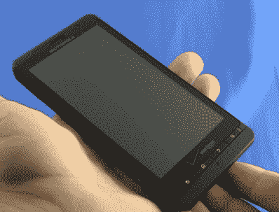

# DroidX 获得自定义恢复映像

> 原文：<https://hackaday.com/2010/08/11/droidx-gets-a-custom-recovery-image/>

[鸟人]已经设法向 DroidX 推送了一个定制的恢复映像。这个以前不可能的动作为各种有趣的黑客行为打开了大门。虽然你现在不能在手机上放一个定制的 Rom，但这是实现这一目标的第一步。你可以在帖子中找到方向，但是在它们变得像越狱一样简单之前还有一段时间。

[via [phandroid](http://phandroid.com/2010/08/11/could-the-droid-x-see-its-first-rom-soon-custom-recovery-image-suggests-so/)