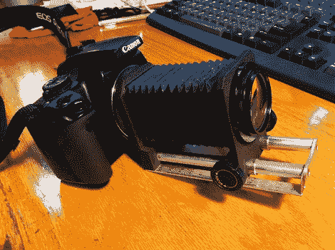

# DSLR 波纹管安装镜头改造

> 原文：<https://hackaday.com/2011/03/09/dslr-bellows-mounted-lens-retrofit/>

在翻一堆旧的摄像设备时，[杰克]无意中发现了一台属于他祖父的相机，他很想看看旧镜头会产生什么样的图像。他对摆弄胶片相机做实验不感兴趣，所以他需要想办法在他的新佳能 DSLR 上安装老式镜头。

在考虑了几个选项后，包括定制加工适配器和用旧佳能镜头制成的安装环，他找到了一个更便宜的解决方案。他购买了一个镜头适配器，用于将特定类型的镜头安装到现代 DSLR 上，然后对其进行修改以适应他的镜头。它工作得非常完美，尽管他承认最终的图像与他用普通镜头拍摄的图像没有什么不同。

由于对这些图像印象不深，他决定将镜头安装在他从当地垃圾场捡来的一套风箱上。它看起来很整洁，但他还没有机会用他的新装置拍任何照片。希望我们能很快看到一些测试镜头。

如果有人有在现代 DSLR 上使用风箱镜头的经验，我们随时准备看一些样本图片。与此同时，看看这个[其他 DSLR/波纹管混合](http://hackaday.com/2011/02/11/bellows-camera-to-dslr/)项目，我们不久前曾重点介绍过。

[via [BoingBoing](http://www.boingboing.net/2011/03/08/hacking-an-old-lens.html)