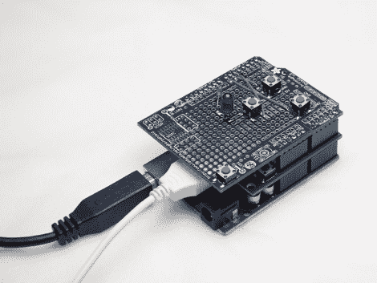

# DSLR 焦点堆叠助手让微距摄影不再费力

> 原文：<https://hackaday.com/2011/10/04/dslr-focus-stacking-assistant-takes-the-hard-work-out-of-macro-photography/>

[焦点叠加可以产生奇妙的微距图像](http://www.circuitsathome.com/camera-control/focus-stacking-assistant-for-eos-cameras)，但是如果没有合适的工具，这个过程可能会很乏味。虽然一些对焦堆叠装置要求相机以小增量远离主体，但其他人选择在每次拍摄前对焦镜头时保持相机静止。

这两种方法都能产生很好的效果，但是你需要一双稳定的手和很大的耐心来完成这项工作。[Oleg]相对频繁地使用焦点堆叠技术，因此他决定自动完成这一过程，以节省自己的时间。他使用 Adafruit 的 Arduino 和 USB 主机护罩，为他的佳能 EOS 相机组装了一个焦点堆叠助手。

助手允许他设置两个焦点，将拍照的任务留给 Arduino 和他的相机。Arduino 命令相机在每幅图像之间稍微调整焦点，从而产生一系列准备堆叠的图像。

他说，目前这个过程有点慢，但他将在未来几周内清理代码，并建立一个尼康兼容的单位。