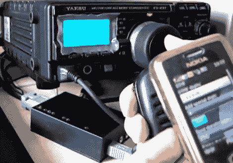

# DTMF 和 SelCall 信号发生器

> 原文：<https://hackaday.com/2010/03/29/dtmf-and-selcall-signal-generator/>

[Rogal]编写了一个名为 [ToneTool 的手机应用程序，可以生成音频音调序列](http://www.tonetool.tk)。它可用于输出电话系统和无线电信硬件使用的 [DTMF](http://en.wikipedia.org/wiki/Dtmf) 和 [SelCall](http://en.wikipedia.org/wiki/Selcall) 序列。该软件是在 J2ME 编写的，所以如果你有一部可以运行 Java 应用程序的手机，它可能会为你工作。这就像是每个人口袋里的数字时代蓝盒子。但我们不认为有太多的机会看到原始电话窃听造成的伤害。

在广告之后的视频中，我们可以看到他通过 Echolink 网络生成和发送 DTMF 命令。

[https://www.youtube.com/embed/l3hI2Dwk6sY?version=3&rel=1&showsearch=0&showinfo=1&iv_load_policy=1&fs=1&hl=en-US&autohide=2&wmode=transparent](https://www.youtube.com/embed/l3hI2Dwk6sY?version=3&rel=1&showsearch=0&showinfo=1&iv_load_policy=1&fs=1&hl=en-US&autohide=2&wmode=transparent)