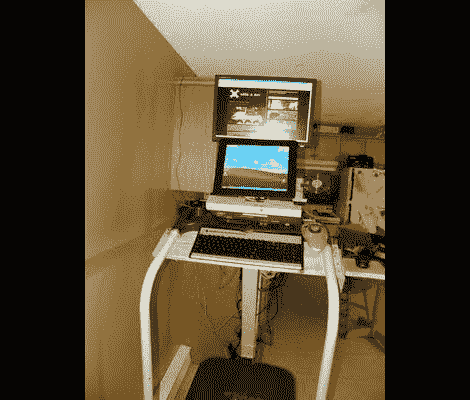

# 双显示器工作站旨在让您在跑步机上跑得更久

> 原文：<https://hackaday.com/2012/03/06/dual-monitor-work-stations-aims-to-keep-you-on-the-treadmill-longer/>

为了让他的锻炼计划保持正轨[Jamie] [为自己建造了这个双屏跑步机工作站](https://sites.google.com/site/jamiemaloway//projects/treadmill-desk)。他在易贝花了大约 50 美元买了这台跑步机，在对其劣质结构进行了一些愚蠢的改造后，最终得到了一台相当不错的设备。

这个项目的第一个作品只是一个放笔记本电脑的木架子。但在跑步机散架，导致他的笔记本电脑翻倒后，他加固了机器，并在这个过程中添加了一些东西。现在有一些定制的电子设备用来跟踪他的进展。他在构成跑步表面的黑带上画了一个白色方块。PIC 微控制器通过光电晶体管和运算放大器对其进行监控。他使用 USB 数据采集卡将皮带转数输入电脑，用于跟踪他的锻炼。

在他的装置中有一台电脑会使上网记录变得轻而易举。[我们周六看到的健身车](http://hackaday.com/2012/03/03/easy-workout-logging-with-ethernet-enabled-exercise-bike/)使用直接以太网连接进行登录，但[Jamie]的设置也可以同样的方式使用。他只需要一个脚本来将收集到的数据与互联网日志网站的 API 连接起来。