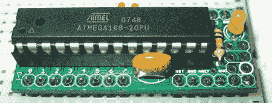

# 杜伊诺斯塔姆

> 原文：<https://hackaday.com/2008/06/27/duinostamp/>

我们认为为了纪念 [DuinoStamp 的小尺寸大功率](http://www.spiffie.org/kits/duinostamp/)，关于它的帖子也应该是小功率的。DuinoStamp 的尺寸约为 34 针 DIP，是一款适合 DIP 插座的分线板，与 Arduino 兼容。它具有 ATmega 168-20PU 芯片、16MHz 谐振器、去耦电容等。它没有配备必要的 5V 电源或任何类型的接口电缆，但你期望低于 10 美元？

*   [永久链接](http://www.spiffie.org/kits/duinostamp/)