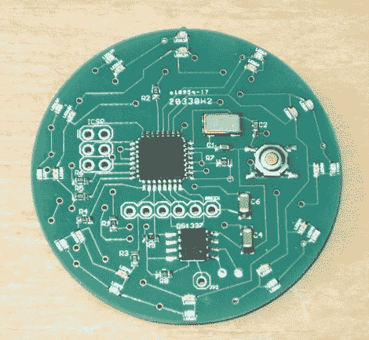

# DWex 手表期待未来发展

> 原文：<https://hackaday.com/2010/08/30/dwex-watch-looks-for-future-development/>

[FlorinC]送来了他的 [DWex Arduino 手表](http://timewitharduino.blogspot.com/2010/06/introducing-arduino-analog-watch.html)，打算兼做实验基地。受[makerbowatch](http://hackaday.com/2009/12/27/makerbotwatch/)的启发，它运行 ATmega328P、DS1337 RTC 和 24 个 led 来显示时间。[FlorinC]告诉我们(即将到来的)表壳和表带将类似于[沃兹的手表](http://hackaday.com/2009/11/03/wozs-watch-makes-air-travelers-nervous/) 以确保机场安检拦截他。至于实验，PCB 包含一个 ICSP6 和一个 FTDI 连接器，用于“非手表用途”。我们都不确定手表还能做什么；我们绞尽脑汁，想出了一个指南针，但有了源代码和 Eagle 文件，也许你有更好的主意？