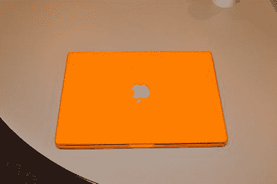

# 染 Mac 染！

> 原文：<https://hackaday.com/2012/02/11/dye-mac-dye/>

织物染料是那些不断出现意外用途的产品之一，我们已经看到它给印刷电路板着色，现在又出现在麦金塔电脑上？[The Brain]为他的 Macbook 增加一点颜色的项目以前已经做过，但他选择用不同的方式来做，这归结为一点点砂纸。

你可以对 Macbook 塑料进行染色，但这层厚厚的光滑塑料需要更多的时间来渗透，它会抵制颜色，所以最终可能会有污点。解决这个问题的简单方法是用砂纸打磨掉光泽，这样颜色对塑料染色的阻碍就小多了。一旦保护性光泽外壳被磨掉并彻底清洁，Rit 品牌的织物染料被加入到一盆水中，并放在炉子上煮沸。

虽然大多数外壳塑料都很厚，足够坚硬，可以承受一些热量，但在处理薄软部件(如显示屏挡板)时，确实需要小心。大约 45 分钟后，零件被染色，并在创纪录的时间内呈现出超亮的橙色。