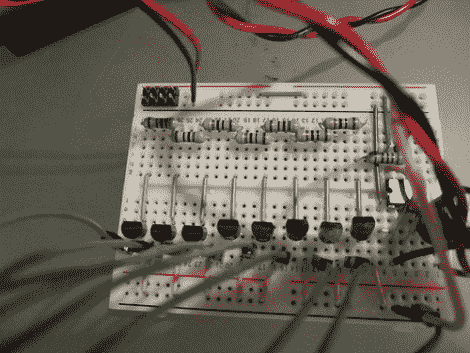

# 地震警报系统

> 原文：<https://hackaday.com/2011/03/02/earthquake-alert-system/>

[Roteno]提交的 555 定时器设计竞赛是一个[互联网连接地震警报系统](http://roteno.com/?q=terremoto)。它监控[美国地质勘探局网站](http://earthquake.usgs.gov/earthquakes/catalogs/)的地震数据，并在地震发生时播放音乐。数据以 TXT 文件的形式作为提要提供，使用 cURL 很容易解析。他选择了一个 [LPCXpresso 板](http://hackaday.com/2011/02/19/free-as-in-free-beer-arm-kit/)(这是一个可以运行 Linux 内核的 ARM 开发平台)以及一个 XPORT 模块来处理以太网流量。

那么 555 定时器在哪里看到一些动作呢？它负责在检测到地震时播放声音。但是只玩一个球不是很有趣。相反，【Roteno】建立了一个电路，在这个电路之上产生了一个由一系列晶体管开关的电阻网络。这样，他可以使用微控制器的 GPIO 来选择不同的音高。休息后请观看视频，了解结果。通电时，所有八种音调都作为测试播放，警报声音的音调和速度根据地震的震级而变化。

[https://www.youtube.com/embed/4NgK3yluhNo?version=3&rel=1&showsearch=0&showinfo=1&iv_load_policy=1&fs=1&hl=en-US&autohide=2&wmode=transparent](https://www.youtube.com/embed/4NgK3yluhNo?version=3&rel=1&showsearch=0&showinfo=1&iv_load_policy=1&fs=1&hl=en-US&autohide=2&wmode=transparent)