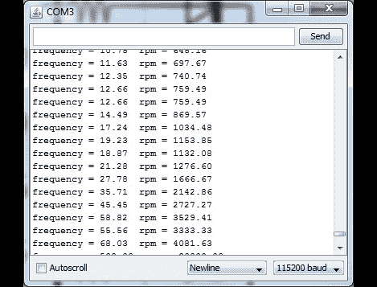

# 简易 DIY 频闪仪

> 原文：<https://hackaday.com/2011/02/23/easy-diy-stroboscope/>

为了在空闲时间找点事做，【闪亮先生】决定[做一个简单的频闪仪](http://mehax.blogspot.com/2011/02/arduino-stroboscope.html)比较合适。在之前的项目中，他已经有一组六个 led 连接到他的 Arduino，所以他添加了一个电位计来控制 led 闪烁的速率，并深入研究了 IDE。

在构建过程中，他发现在高速下使用 Arduino millis()函数会提供糟糕的分辨率，而使用 micros()函数则会限制他的低端测量能力。他想要一个更好的测量范围，所以他的程序被分成几个主要函数:一个以毫秒为单位测量 LED 闪烁频率，另一个以微秒为单位测量 LED 闪烁频率。这使他能够测量从 577 到 30，000 RPM 的旋转频率。

[Mista Sparkle]承认他还不太擅长用 Arduino 驱动显示器，所以他通过 PC 上的串行连接查看读数。希望我们能在不久的将来看到带有这些功能的更新版本。