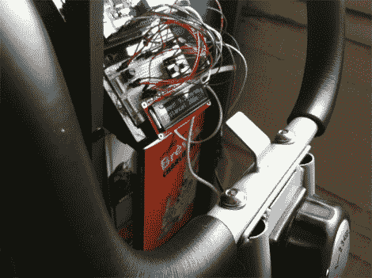

# 使用支持以太网的健身车轻松记录锻炼数据

> 原文：<https://hackaday.com/2012/03/03/easy-workout-logging-with-ethernet-enabled-exercise-bike/>

如果你不需要做任何事情来记录你的锻炼，就很容易让你的日常锻炼保持在正轨上。[Reefab]为他的健身车开发了这个附加硬件，它可以自动在互联网上记录他的锻炼情况。

他使用 RunKeeper 来存储和显示锻炼数据。他们提供了一个基于令牌的 API，在他的 Arduino 草图中实现了这个 API。从健身车上获取数据的硬件设置非常简单。一个稀土磁体被添加到飞轮上，旁边有一个簧片开关，用来测量转数和转速。这正是一台消费自行车计算机的工作原理，只需要一次精确的测量就可以知道车轮每转一圈自行车行驶了多远。

除了网络记录功能之外,[Reefab]还包括一个字符显示屏，这样您就可以在锻炼过程中跟踪您的速度和距离数据。