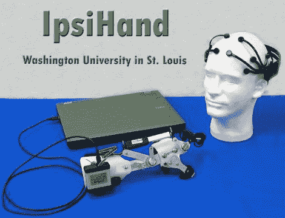

# 脑电图辅助手控

> 原文：<https://hackaday.com/2011/04/29/eeg-assisted-hand-control/>

[Sam Fok]是华盛顿大学工程学院的一名工程系学生[来信分享了他和他的同学[Raphael Schwartz、Mark Wronkiewicz、Charles Holmes、Jessica Zhang、Nathan Brodell 和塔那·萨默斯]正在进行的一个项目](http://aac-rerc.psu.edu/wordpressmu/RESNA-SDC/2011/04/27/ipsihand-direct-recoupling-of-intention-and-movement-washington-university-in-st-louis/)，该项目是他们参加 2011 年 [RESNA 学生设计竞赛](http://aac-rerc.psu.edu/wordpressmu/RESNA-SDC)的参赛作品。他们的项目 IpsiHand 旨在帮助中风或其他创伤性脑损伤患者康复(TBI)。

身体的大多数运动功能都是由大脑的对侧半球控制的，这个过程被称为对侧运动控制。当患者患有 TBI 病时，他们通常会对与受伤部位相对的身体部分失去控制。然而，最近的研究表明，虽然大多数运动控制是对侧的，但手的运动也会产生同侧的大脑活动。这意味着大脑未受伤的一侧可以在一点机械辅助下有效地控制双手。

他们的过程使用我们在之前讨论过的 [Emotiv Epoch EEG 耳机](http://hackaday.com/2011/04/10/brainwave-based-assistive-technology-in-the-home/)、[，来监控患者的大脑活动。数据被无线发送到计算机，计算机处理数据，挑选出同侧的脑电波。然后，计算机启动修改后的手部矫形器来实时控制抓握。](http://hackaday.com/2011/02/18/brain-car-interface/)

我们认为他们的工作非常出色，该团队的发明在治疗和辅助生活领域有着广泛的应用。我们希望他们在比赛中好运，并希望看到这项技术在未来得到很好的利用。