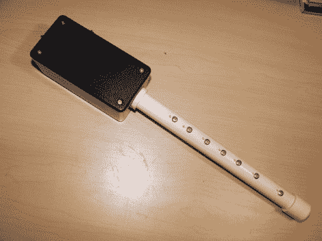

# 电子袋管不需要袋子，只用一根管子

> 原文：<https://hackaday.com/2012/02/23/electronic-bag-pipes-need-no-bag-and-use-only-1-pipe/>

许多人可能会对电子版的风笛嗤之以鼻。但是我们认为确实需要它们。毕竟，在公路旅行中带着风笛是相当困难的，但是这个电子乐器可以毫不费力地娱乐你的旅伴。

该乐器基于 Arduino，制造商可以决定是使用耳机插孔(当在车上时，与调频发射机一起使用！)还是一个演说家。上面看到的版本使用一根 PVC 管作为主体的耳机，螺丝头作为触摸传感器，以及一个容纳电子设备的项目箱。但是也有很多替代建议，比如使用自动喷水部件。这听起来像一个立管，连接器和弹出式洒水喷头体将做好托管所有的组件。

想听听是什么声音吗？在最后步骤部分的[下面有一个 mp3 片段。](http://www.echanter.com/home/howto-build#TOC-FINAL-STEPS)

[audio http://www.echanter.com/marine-corps-hymn.mp3]