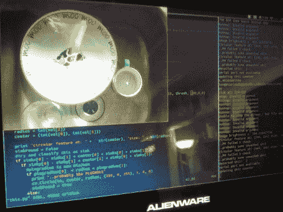

# 告诉你洗碗的电子设备

> 原文：<https://hackaday.com/2012/01/16/electronics-that-tell-you-to-wash-the-dishes/>

没有什么比装满脏盘子的水槽更能使房子发臭的了。好吧，一个满满的垃圾桶可以在更大程度上做到这一点，但这是另一天的项目。在他伦敦的黑客空间，肯定是对一个永远装满盘子的水槽的过度反应，[汤姆]建造了一个联网的脏盘子探测器。

他称之为伟大的 OpenCV 清洗检测器。该系统以一系列不同的信号为特色，以“提醒”健忘的极客们清理自己的垃圾。最初的实现使用交通信号来提醒房间有脏盘子要清理；点亮不同的颜色来显示水槽已经满了多长时间。[Tom]还计划在 IRC 房间增加信息脉冲，当情况变得可怕时鸣笛。

顾名思义，它使用 OpenCV 来检测水槽中的圆圈。一个摄像头安装在它的上方，指向下方，提供了一个清晰的输入图像，以检测盘子，杯子等。[Tom]甚至写了一些代码，可以在关灯时关闭系统。

当然，这可能会训练违法者将盘子留在检测器看不到的柜台上。