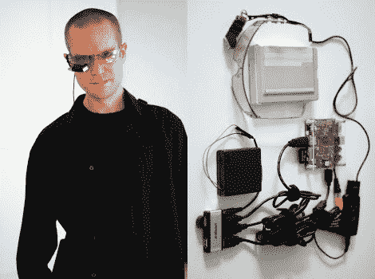

# 优雅的可穿戴计算机

> 原文：<https://hackaday.com/2010/07/30/elegant-wearable-computer/>

【杰森·斯坦森】【马丁·马格努松】来信告诉我们他在[建造可穿戴电脑的冒险经历](http://blog.2yb.org/2010/07/cd-case-wearable-computer.html)。该设备目前的状态是一个运行 Angstrom Linux 的 [Beagleboard](http://blog.2yb.org/2010/06/setting-up-beagleboard-miniature.html) ,与 iPhone 相连，用于互联网。蓝牙键盘允许输入，而输出显示在单片 Myvu 上。最后但同样重要的是，整个装置由 4 节 AA 电池供电，续航时间为 3 小时。

它不像我们之前见过的一些可穿戴电脑那么小，但是如果你想自己动手，它肯定需要更少的焊接。