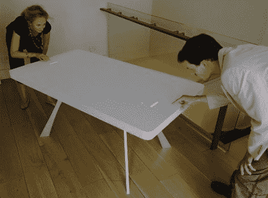
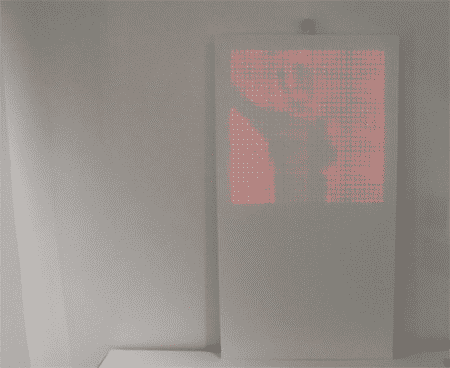

# 嵌入式 LED 乒乓球台

> 原文：<https://hackaday.com/2008/05/28/embedded-led-pong-table/>

生活中很少有经久不衰、不言自明的事情，但我们的短名单上有一件事就是对 Pong 的热爱。设计师[Moritz Waldemeyer]显然和我们一样痴迷:你可能还记得他为 OK Go 设计的 [LED 内衬的舞台制服](http://www.dezeen.com/2007/11/26/ok-go-stage-costumes-by-moritz-waldemeyer/)，但这个乒乓球台的概念肯定更古老，可以说更棒几倍。

Corian 表是杜邦公司在 2006 年委托生产的。桌子内部有 2400 个红色发光二极管，两端各有一个触摸传感器。触控板控制球拍的运动，发光二极管显示球拍的位置以及球的位置。由于 led 完全嵌入，它仍可用作桌子。它最近在 MOMA 一个名为[设计和弹性思维](http://moma.org/exhibitions/2008/elasticmind/)的展览中展出。

【瓦尔德迈尔】也用类似的规格创造了配套的 LED 镜子。镜子的设计与桌子非常相似，但它没有使用触控板进行输入，而是使用安装在顶部的网络摄像头。摄像机捕捉到前方任何物体的图像，并通过改变发光二极管的强度显示为“反射”。

今年早些时候，他展示了他为 FLOS 设计的一款简单的[迷你 SMD POV](http://waldemeyer.blogspot.com/2008/04/i-just-returned-from-milano-salone-del.html) 。只生产了 500 台，所以你可能一台也买不到。由于乒乓桌是独一无二的，并且是巡回设计装置的一部分，你在那里的机会就更小了。

[通过 [Gizmodo](http://gizmodo.com/393770/dining-table-recreates-pong-with-2400-leds-and-2-trackpads)