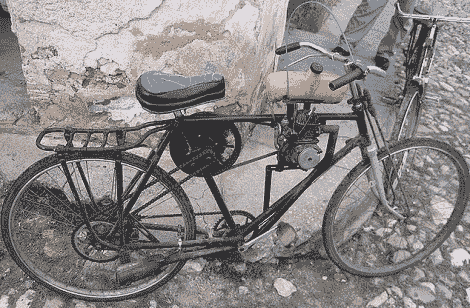

# 引擎黑客:Riquimbilis，或者:如果我们买不起车，我们会怎么做

> 原文：<https://hackaday.com/2011/09/08/engine-hacks-riquimbilis-or-what-wed-do-if-we-couldnt-buy-a-car/>

1962 年，美国对古巴实施了近乎全面的经济禁运，此后，美国停止了底特律铁矿的出口。从那以后，一些古巴人幸运地拥有了一辆经典的雪佛兰或别克。苏联从 20 世纪 90 年代开始停止进口伏尔加。由于缺乏任何形式的机动化交通工具(公共交通系统甚至比美国的还要糟糕)，一些古巴人选择了唯一合理的解决方案:他们建造了 Rikimbilis，将自行车和发动机组装成一辆轻便摩托车。

[大多数 rikimbilis](http://ernestooroza.com/index.php?option=com_content&view=article&id=179:rikimbili&catid=36:objectsofnecessityresearchcollection&Itemid=74) 都是基于中国自行车，通过“非常规手段”获得电机。排气管可以由任何可用的金属管制成，塑料汽水瓶是首选的气罐。这些自行车上的一切都是出于经济和可用性的原因，[的燃油效率是无与伦比的](http://havanajournal.com/culture/entry/riquimbilis_cubans_build_homemade_motorcycles_for_transportation/)，一些 rikinbilis 获得了 120 英里/加仑。

因为它们不是特别安全，Riquimbilis 在古巴是非法的，但是警察通常对它们的使用视而不见。最近，古巴政府开始打击 riquimbilis，但是由于没有太多的汽车，这些机器很可能会继续在哈瓦那的大街上行驶。