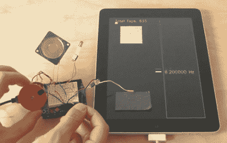

# 扩展触摸屏的可用性

> 原文：<https://hackaday.com/2011/06/08/extending-the-usability-of-touchscreens/>

粉丝们可能会对在 iPad 屏幕上贴胶带感到震惊，但我们可以向你保证这是以科学的名义。[Michael Knuepfel]正在为 Tisch 艺术学院的 ITP 研究生项目撰写论文。他设法通过增加硬件来增强触摸屏设备的可用性。

他想出了既能输入又能输出的装置。输出设备通常依赖于屏幕上显示的光和光的颜色，该光和光的颜色由光传感器拾取。输入设备使用导电材料来完成你的手和屏幕之间的通路。这使得电容式感应屏幕通过导体检测到您的手的存在。他的一些示例设备包括游戏控制器覆盖层、编码器环和多触控笔设计。

休息之后，我们嵌入了[迈克尔的]预告片，它跳过了几个演示。这足以让你动脑，但如果你想知道更多，你必须看他的论文介绍。在这个页面上可以下载到 MP4。只要搜索他的名字，[迈克尔·克努普费尔]就能找到正确的链接。

[https://player.vimeo.com/video/23507405](https://player.vimeo.com/video/23507405)

[通过[使](http://blog.makezine.com/archive/2011/05/touchscreen-interface-hacks.html)