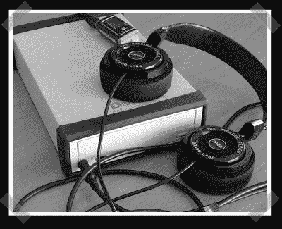

# 外置 CD-ROM 转 A 类耳机放大器

> 原文：<https://hackaday.com/2008/07/01/external-cd-rom-turned-class-a-headphone-amp/>

【Gio】[送来了这个](http://diyaudioprojects.com/Solid/IRF610-Class-A-Headphone-Amp/)华而不实的 A 级耳机放大器。一个旧光盘盒被挖空来装货物。这个设计相当简单。成本可以保持相当低，尽管如果你对质量很狂热，电容可能会增加。如果你曾经因为粘手指而丢失过耳机，你会知道让它融入背景是一个很棒的功能。

*   [永久链接](http://diyaudioprojects.com/Solid/IRF610-Class-A-Headphone-Amp/)