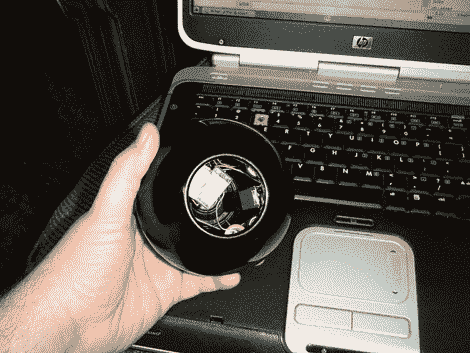

# 神话般的魔术 8 球恶作剧

> 原文：<https://hackaday.com/2011/01/28/fabulous-magic-8-ball-prank/>

Hackaday 论坛用户[arfink]向我们展示了他创造的一个绝妙的恶作剧。这是一个[魔法 8 球，当你把它翻转过来的时候，它会用一道闪光把你](http://forums.hackaday.com/viewtopic.php?f=3&t=79)弄瞎。你有没有在一个房间里有一个这样的东西，而*没有*把它翻过来？我们也没有。利用从一次性相机上撕下来的基本闪光电路和水银开关，这个项目花了他大约 2 个小时完成。诚然，大部分时间只是试图分裂 8 球的一半，而不是完全摧毁它。电路非常简单。只要找出需要交叉哪 2 根线来触发闪光灯，并在那里安装你的倾斜开关。他加了一个断电装置，这样你也可以关掉它。

更新:休息后添加视频！

[https://www.youtube.com/embed/Xu01p9kGoFk?version=3&rel=1&showsearch=0&showinfo=1&iv_load_policy=1&fs=1&hl=en-US&autohide=2&wmode=transparent](https://www.youtube.com/embed/Xu01p9kGoFk?version=3&rel=1&showsearch=0&showinfo=1&iv_load_policy=1&fs=1&hl=en-US&autohide=2&wmode=transparent)