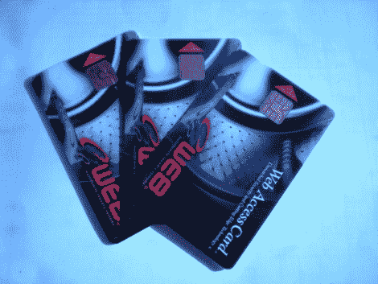

# 储值卡中的掴脸安全装置

> 原文：<https://hackaday.com/2010/09/07/face-slapping-security-gaff-in-stored-value-cards/>

(汉斯·维克斯勒的)公寓里的洗衣机从投币操作转换成了储值卡。我们以前都和这些卡打过交道，[Hans]认为稍微调查一下这家公司是如何实施这些卡的会很有趣。我们已经介绍了[如何读取这些卡](http://hackaday.com/2008/11/25/how-to-read-a-fedex-kinkos-smart-card-sle4442/)，也有几个关于[如何绕过他们使用的安全](http://hackaday.com/2006/03/02/fedex-kinkos-smart-cards-hacked/)的故事。

但是[汉斯]对窃取价值不感兴趣，只是想看看东西是如何工作的。所以他把卡插入读卡器，四处看了一下，发现他们用的是 Atmel AT88SC0404C 芯片。他下载了数据表，开始梳理特性和命令。这些卡有一个四错密码锁定策略。他计算出平均需要 200 多万张卡才能暴力破解芯片存储的密码。但进一步的研究表明，这是一个有争议的问题。他把数据表上的默认密码输入到他的卡上，成功了。

我们知道普通人(Joe)在家里操作这些卡需要相当多的知识，但更改默认密码实际上是该公司为保护他们的系统所能做的最起码的事情。