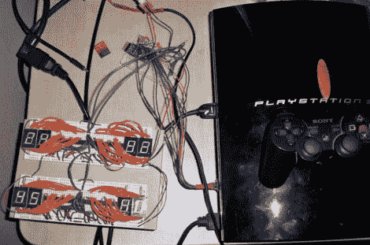

# PS3 温度控制的风扇节流

> 原文：<https://hackaday.com/2011/06/02/fan-throttling-for-ps3-temperature-control/>

这个设置将让你[监控 Play Station 3 的温度，并相应地调节冷却风扇](http://killerbug666.wordpress.com/2011/06/01/introducing-ps3-hardware-mod-firmware/)。[Killerbug666]基于 Arduino 板的项目，关于他的设置的大部分细节都作为他在帖子中嵌入的草图中的评论进行了分享。他在 PS3 的 CPU 散热器、GPU 散热器、北桥或情感引擎上安装了四个热敏电阻，并在进气格栅前安装了一个，以测量室温。

上面你可以看到他用来在一组 7 段显示器上显示每个传感器温度的设置。该项目还包括通过串行连接推送数据的能力，以供计算机或独立系统使用。

该项目仍处于原型阶段。这是可行的，但他把风扇节流比作汽车引擎不断加速的声音。未来的计划包括平滑风扇速度校正和缩小系统中使用的硬件尺寸。我们建议去掉三个显示器，并添加一个按钮，让您选择想要显示哪组传感器数据。

[感谢用户]