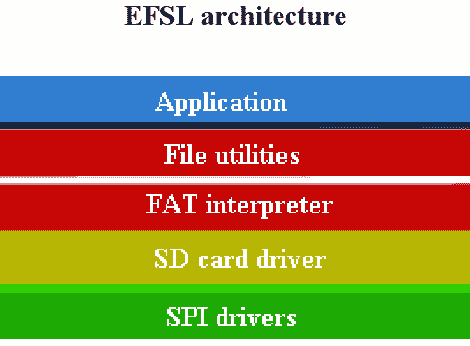

# FAT 支持任何微控制器

> 原文：<https://hackaday.com/2010/02/07/fat-support-for-any-microcontroller/>

[Rahul Sapre]给我们发来了一份将 EFSL 移植到任何微控制器的指南(PDF) 。[嵌入式文件系统库](http://efsl.be/)为 C 编译的微控制器增加了 FAT 支持。它的目标是 AVR 系列芯片，但也可以适用于任何使用 C 编译器的架构。[Rahul 的]指南将通过使用 PIC uC 作为工作示例，带您完成将最新的稳定 0.2.8 版本适配到新硬件的过程。不稳定的 EFSL 的[开发分部正在致力于多平台支持，所以如果你对此感兴趣的话，请考虑伸出援手。](http://sourceforge.net/projects/efsl/)