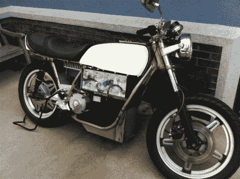

# 感受你两腿间电流的嗡嗡声

> 原文：<https://hackaday.com/2011/08/10/feel-the-hum-of-electricity-between-your-legs/>

这里有一个小眼睛糖果摩托车爱好者无处不在。这是[【朱利安的】电动摩托车](http://el8id.com/arthive/?p=685)的最新迭代。他显然知道自己在做什么，因为一切都以一种仍然非常悦目的方式融入了画面。但这实际上是从最初的设计中瘦下来的。如果你[回顾一下](http://el8id.com/arthive/?p=581)他的一些旧帖子，你会发现四个相对较小的锂电池是新添加的。

这个框架被设计成容纳四节铅酸电池。这些东西确实占据了很大的空间，并增加了车辆的重量。他最近的升级还伴随着重新装备，使他能够达到更高的速度(尽管他没有说最高速度实际上是多少)。你在上面看不到它，但是[Julian]在汽油摩托车的油箱位置放了一个木制插件。它装有控制开关和 48V 电压表。这是一个奇妙的点睛之笔，就像圣代上的樱桃。