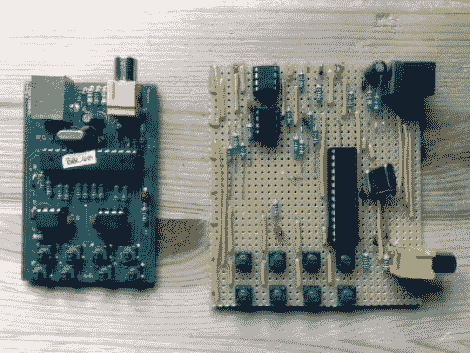

# FIGnition FLINT 是一个由简单计算机组成的条形板

> 原文：<https://hackaday.com/2011/11/18/fignition-flint-is-a-stripboard-build-of-the-simple-computer/>

如果你想让人们对你的项目留下深刻的印象，最好不要有一个完全完成的外观。在这种情况下，我们认为将 FIGnition 的条形板版本连接到您的电视上会比 PCB 版本引起更多的关注。

[Julian]整理了一份在条形板上构建计算机的指南。他使用自己的 Java 应用程序在这种多功能原型衬底上设计电路。这个工具值得一看，因为它可以简化你一直苦恼的点对点焊接原型。你必须在他的网站上四处打探，收集完成构建所需的所有知识。大多数元件很容易找到，但除非你手头有，否则你需要订购晶体、ATmega168、SRAM 芯片和闪存芯片。

对于那些不熟悉的人来说，[figuration 是一台 8 位计算机](http://sites.google.com/site/libby8dev/fignition),带有复合电视输出显示和来自八个瞬时按钮的基本输入。