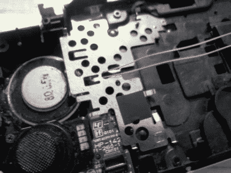

# 在你的 PSP 上填入低音

> 原文：<https://hackaday.com/2012/02/13/fill-in-the-bass-on-your-psp/>

[陈赫]觉得他的 PSP 发出的声音需要更多的维度。有些人可能会给自己买一副漂亮的耳机，但他却拿起了他的烙铁，并且[找到了一些空间，他可以在那里添加一个更大的扬声器](http://www.instructables.com/id/PSP-Speaker-Mod-1)。

移动设备倾向于将尽可能多的东西塞进小巧的外形中，所以我们很惊讶他居然能腾出空间。但是很明显，如果你从盒子里面切掉一点，存储卡下面就有空间了。[Michael]提醒您，您需要选择一个额定值为 8 欧姆或更大的扬声器，以便将其作为两个原装扬声器之一的替代产品。但他也提到了一种既能使用传统扬声器又能使用新扬声器的方法。他建议拿一个 LM386 运算放大器和一个电容，将它们连接起来。是的，如果你把它装成死虫子的样子，也是有空间的。我们想知道这次攻击会对电池寿命产生什么影响？