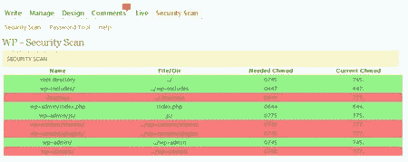

# 保护你的 WordPress 博客的五个插件和技巧

> 原文：<https://hackaday.com/2008/07/26/five-plugins-and-tips-to-secure-your-wordpress-blog/>

你如何保护自己的博客不被黑？从来没有万无一失的答案，但是通过一些额外的工具和谨慎，你可以让你的网站变得安全一点，不会受到伤害。猫谁代码有[五个插件和提示你可以使用](http://www.catswhocode.com/blog/blogging/5-plugins-and-tips-to-secure-your-wordpress-blog-19)来保护你的 [WordPress](http://www.mahalo.com/Wordpress) 安装。一些技巧是常识性的建议，可以应用于任何与技术相关的事情，例如经常备份和使用强密码。其他的包括推荐插件，可以帮助你验证你的 WordPress 安装是否有任何安全漏洞，或者隐藏你正在使用的 WordPress 版本的小技巧。你有什么有用的插件或技巧可以分享，让你的博客免受黑客攻击？

[via [Digg](http://digg.com/programming/5_plugins_and_tips_to_secure_your_Wordpress_blog)

*   [永久链接](http://www.catswhocode.com/blog/blogging/5-plugins-and-tips-to-secure-your-wordpress-blog-19)