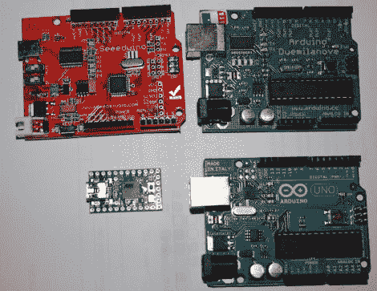

# 修复 Arduino 的串行延迟问题

> 原文：<https://hackaday.com/2011/05/18/fixing-arduinos-serial-latency-issues/>

[Paul]写信告诉我们一些有趣的 [Arduino 延迟问题](http://neophob.com/2011/04/serial-latency-teensy-vs-arduino/)他帮助确定并修复了 Arduino。

似乎[Michu]在控制他的 [Rainbowduino 项目](http://hackaday.com/2011/02/09/daft-punk-module-just-add-table/)时遇到了一些问题，我们今年早些时候报道过，他不太明白为什么他在发送和接收数据时会遇到如此大的延迟。

在网上搜索得到的答案很少，由于[Michu]使用了处理，两人设计了一组测试来看看 Java 引入了什么样的延迟。通过将 Arduino Uno 和 2009 年的 Arduino 与 Teensy 2.0 进行对比，测试评估了本地数据传输的延迟与 Java 通过 rxtx 库进行串行通信的传输的延迟。

结果相当惊人。虽然两个 Arduinos 都远远落后于 Teensy，但它们在 Java 下的延迟值总是至少为 20 毫秒——这有些不合情理。[Michu]查看 rxtx 代码，发现一个神秘的 20 毫秒延迟被编程到串行库中。这对他来说毫无意义，所以他将延迟改为 2 毫秒，并看到传输少于 128 字节的数据时性能大幅提高。

当传输大量数据(> 1kB)时，这对修复似乎不会影响延迟，但当处理较小的数据块时，情况就大不相同了。

为了公开起见，应该指出[Paul 的]公司生产 Teensy mcu。