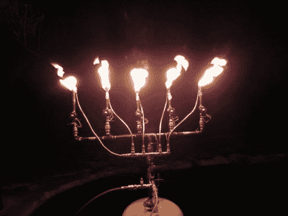

# 燃烧的吉他英雄

> 原文：<https://hackaday.com/2011/01/05/flaming-guitar-hero/>

[克里斯·马里恩]知道他想玩火，或者更准确地说，是玩火球喷涌阀，但他需要一个好的项目来使用它们。灵感终于来了，他制作了这个控制器，它将火球与吉他英雄控制器上的音柱按钮匹配。这里面有很多东西，但我们认为他打了一个本垒打。基本组件是一个带有电子驱动阀的歧管，另一个用于指示灯的歧管，以及一个改进的吉他英雄控制器。

为了连接控制器，他使用了一个 Arduino 和[比尔·波特的] [PS2 库](http://www.billporter.info/playstation-2-controller-arduino-library-v1-0/)来读取按钮的信号。但是真正的劳动密集型部分是由歧管带来的。有一个五金店价值的配件和灵活的铜管进入组装。最后，这一切都在一周内完成了。

[谢谢比尔]