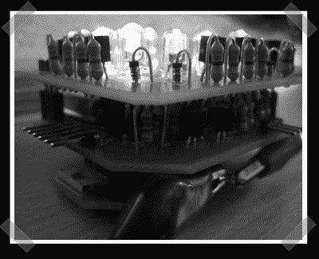

# Fnordlicht: RGB 混合 LED 灯

> 原文：<https://hackaday.com/2007/09/28/fnordlicht-rgb-mixing-led-light/>

*当【威尔】躲在他的离岸数据仓库时，Hack-A-Day 很高兴地欢迎我们资深的驻外记者【fbz】。她承诺，未来的帖子将大大减少“德国的例子”。-【艾略特】*

[Fnordlicht](http://www.lochraster.org/fnordlicht/) 是一个混色 LED 平台，具有免费的硬件原理图和最初由[fd0]启动的开源固件。该系统是动态可控的(通过 [RS-485](http://en.wikipedia.org/wiki/EIA-485) )，也可以独立工作，预装混色。我有一个这样的焊接和工作在家里；这些电路由三块电路板堆叠而成，带有可选的串行电平转换器附加电路板。还有关于 Fnordlicht 的德语[项目页面](http://koeln.ccc.de/prozesse/running/fnordlicht/)，其中包括一些[首架原型机](http://koeln.ccc.de/prozesse/running/fnordlicht/fotos-prototyp1.xml)的照片。完整套件(" Fnordlicht Bausatz "意为" Fnordlicht 套件")和印刷电路板("Fnordlicht platinensaz ohne Bauteile "意为"不带零件的 Fnordlicht 电路板套件")可从他们的[商店](http://ws.lochraster.org/ws/index.htm)购买，但务必先询问他们到您所在地的运费。我喜欢这个项目，我点燃它，把它贴在我房间的一个角落，增加一些变色的气氛。

不久前[Eliot]报道了 momo light，这是一个由显示器上播放的颜色控制的变色 led 项目。

*   [永久链接](http://www.lochraster.org/fnordlicht/)