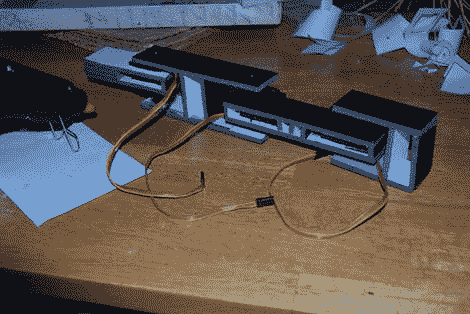

# 泡沫板伺服驱动臂

> 原文：<https://hackaday.com/2010/07/15/foam-board-servo-driven-arm/>

[Lucky Larry]在 Hack a Day flickr pool 上发布了一些引起我们注意的图片。他[做了一个快速便宜的伺服驱动臂](http://luckylarry.co.uk/arduino-projects/arduino-robot-arm-larryarm-v0-1/)。他用泡沫板和一些业余爱好的伺服系统构建而成，用 Arduino 做大脑。你可以在他的网站上下载手臂图案和代码。

他最终发现，他有定位问题，他归咎于廉价的伺服。你可以在他网站上的视频中看到，它正在画的圆圈正在向一个方向漂移。