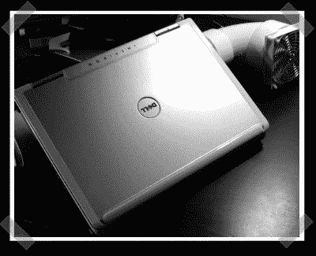

# 强制通风笔记本电脑冷却

> 原文：<https://hackaday.com/2007/05/20/forced-air-laptop-cooling/>

在之前，我们已经见过一些奇特的笔记本电脑散热解决方案[。这台](http://www.hackaday.com/2006/10/13/removable-laptop-water-cooling/) [one](http://www.tacticalgamer.com/hardware-software-discussion/91613-110cfm-laptop-cooler.html#post709385) 引起我的注意只有一个原因——我自己也有一台 e1705。(配有碎屑介质按钮涂料)。它不是最时尚的，但[WhiskeySix]结合了一些 PVC 管和一个可调的高流量风扇，使他的戴尔得到了重大的气流升级。我想看到一个建立匹配的排气口在后方。当然，这并不漂亮，但他能够将他的帧速率提高 50%。感谢【Wimpinator】的[提示](http://hackaday.com/tips)。

*   [永久链接](http://www.tacticalgamer.com/hardware-software-discussion/91613-110cfm-laptop-cooler.html#post709385)